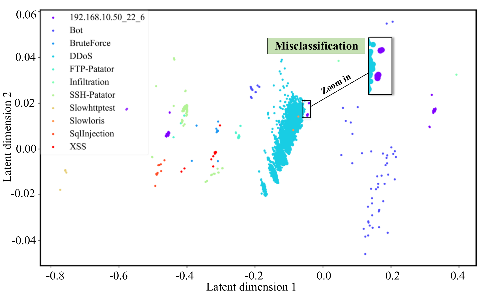
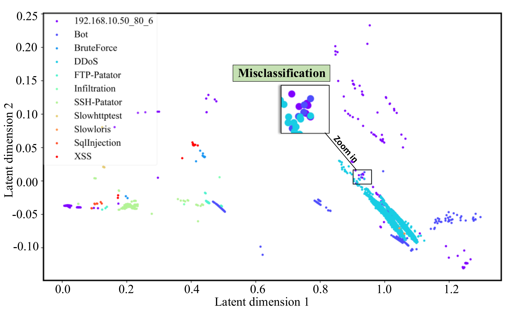
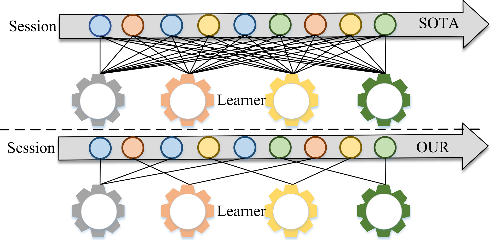
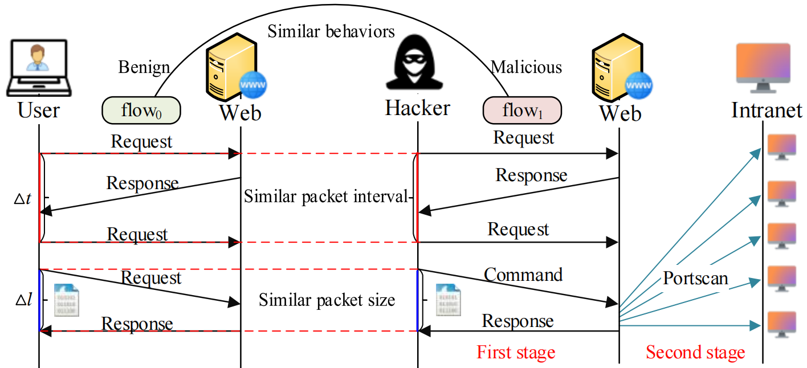
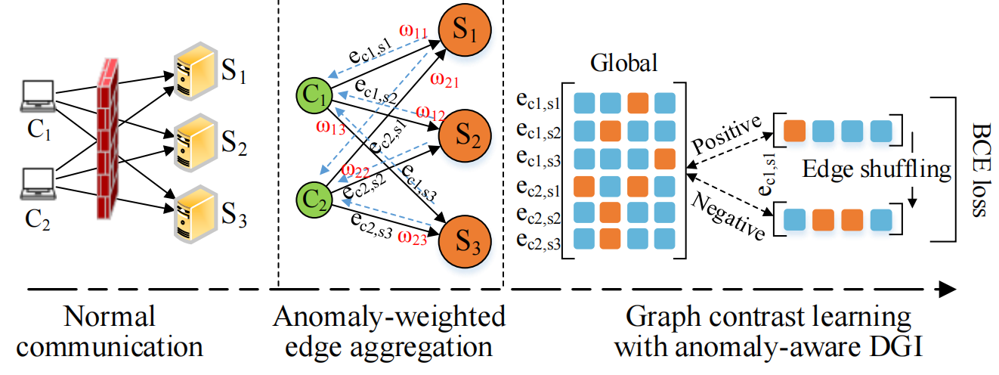
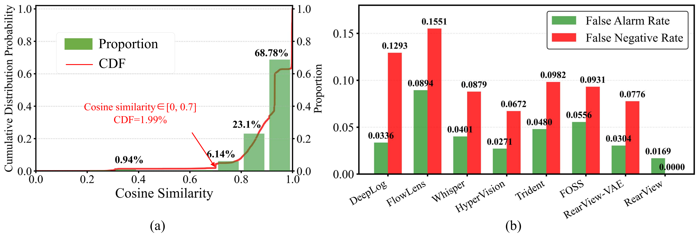
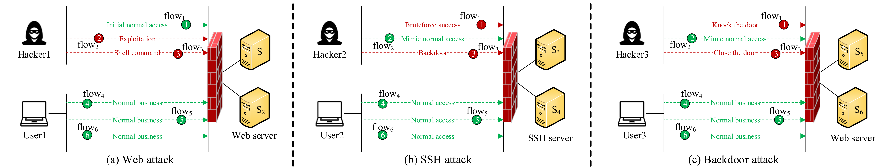
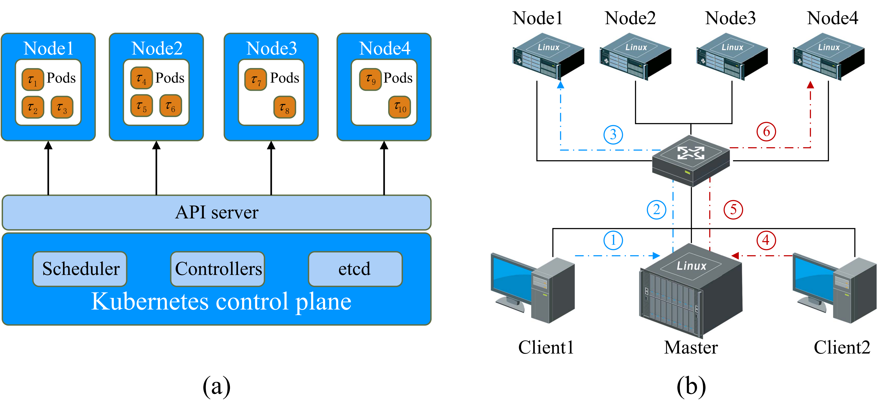
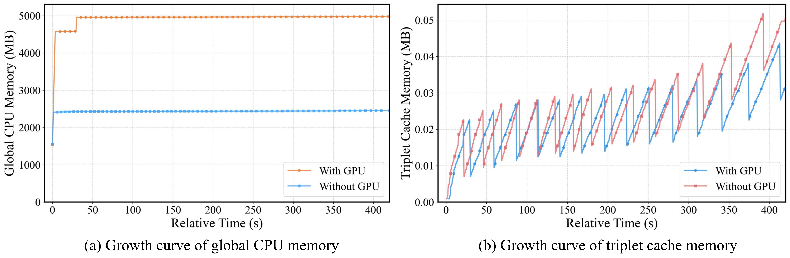

**We sincerely thank all reviewers for their valuable comments. Below is a consolidated response to all feedback.**

 

## 1. Clarifying Doubts

### 1.1 Motivation (To Reviewer1-W1, Reviewer3-W1)  

##### (i) The interweaving of traffic from different service types increases the difficulty of identification. (Our solution: propose a triplet (ip+port+proto) oriented model construction approach.)

In existing traffic classification studies, previous schemes fed all benign traffic types (*e.g.,* SSH, Web, FTP) into the model en bloc (*FlowPic_TNSM2021, ET-BERT_WWW2022*). However, benign traffic comprises various applications with distinct behavioral patterns. This leads to misclassifications where a malicious session may be closer to an unrelated benign session than to other malicious ones. 

For better understanding, we trained a one-class learner with benign traffic on a specific port and tested it on various malicious traffic. The results in **Fig.1-Fig.3** uncover notable misclassification instances. For example, DDoS attacks are hard to distinguish from normal SSH traffic (**Fig. 1**). Botnet activity on port 8080 overlaps with benign web traffic on port 80 (**Fig. 2**) and FTP services on port 21 (**Fig. 3**). However, these misclassification instances occur on traffic of different types of services. Therefore, if we use service type to perform a preliminary screening on traffic, a one-class learner will not struggle with these unnecessary misclassifications. 

<table>
  <tr>
    <td align="center"> <!-- 单元格内容居中 -->
        <!-- 换行分隔图片和标题 -->
      
Fig.1 Training on benign SSH traffic for detecting non-SSH threats 

    </td>
  </tr>
</table>

<table>
  <tr>
    <td align="center"> <!-- 单元格内容居中 -->
        <!-- 换行分隔图片和标题 -->
      
Fig.2 Training on benign HTTP traffic for detecting non-HTTP threats 

    </td>
  </tr>
</table>

<table>
  <tr>
    <td align="center"> <!-- 单元格内容居中 -->
        <!-- 换行分隔图片和标题 -->
      
Fig.3 Training on benign FTP traffic for detecting non-FTP threats 

    </td>
  </tr>
</table>

Some studies analyze benign traffic by category (*e.g.,* videos, emails) (*Trident_WWW2024, Open-Detect_TIFS*2025) or similarity (*CVAE-EVT_TIFS2021*). However, these methods fail to resolve the fundamental issue of interweaving traffic from different applications. Moreover, their approach of forcing each session through multiple classifiers significantly reduces detection efficiency. As shown in **Fig. 4**, four classifiers in an enterprise network require each session to undergo four sequential detections. Under our experimental environment, a single model takes 0.5ms per session, while four models accumulate to 2.1ms, introducing latency that degrades user experience, especially with numerous classifiers. Thus, a system that can route each session to the appropriate learner efficiently is critical. This not only improves detection speed but also enables fine-grained identification of benign traffic by service type.

<table>
  <tr>
    <td align="center"> <!-- 单元格内容居中 -->
        <!-- 换行分隔图片和标题 -->
      
Fig.4 Comparison of detection efficiency of one-class learners. Sessions with the same color come from the same service. 

    </td>
  </tr>
</table>

##### (ii) Intra-flow features alone cannot detect disguised attacks. (Solution: combine graph-based self-supervised learning with contextual information.)

Although flow-based methods demonstrate some advantages (*WebWitness_USENIX2023, FOSS_ToN2024, Trident_WWW2024*), intra-flow feature representation still has certain limitations. These methods, while effective in specific scenarios, often falter when malicious traffic closely mirrors benign traffic. 

On the one hand, some attack behaviors are difficult to distinguish from normal traffic in terms of their intra-flow features. For example, illegal login behavior using legitimate SSH login credentials has the same characteristics as normal behavior. 

On the other hand, attackers commonly use traffic morphing techniques to imitate legitimate communication patterns (*Tantra_TIFS2022*). They do this by matching protocol specific packet sizes, arrival times, and handshake sequences. As depicted in **Fig.5**, the attacker evades detection by mimicking normal behavior in the first phase, and reveals his true nature in the second phase (*Mitre_ATT&CK*). Such techniques can evade traditional detection mechanisms that rely solely on intra-flow features. As a result, it becomes challenging to differentiate between legitimate and malicious traffic.

<table>
  <tr>
    <td align="center"> <!-- 单元格内容居中 -->
        <!-- 换行分隔图片和标题 -->
      
Fig.5 Adversarial mimicry behavior in multistage attack patterns: initial phase replicates legitimate session characteristics, followed by scanning of internal service ports. 

    </td>
  </tr>
</table>

##### (iii) Centralized detection in cloud networks causes bandwidth bottlenecks. (Solution: distributed lightweight local detection combined with global graph-based detection.)

A further compounding issue lies in the fundamental incompatibility between existing monolithic, centralized architectures and modern distributed networks [1]. Traditional systems enforce the convergence of traffic from edge devices, end nodes, and cloud instances at a central server for detection purposes [2], and this traffic convergence directly gives rise to three critical challenges. 

First, it leads to significant detection latency, which originates from two key factors: the long-distance transmission of traffic data to the central server and the computational overload of the server when processing large-scale traffic volumes. 

Second, it results in massive core bandwidth consumption, as full-volume traffic generated by distributed nodes must be aggregated and transmitted to the central hub. 

Third, it imposes extremely high hardware performance requirements on the central server, as the server needs to possess sufficient computing and storage capabilities to support the large-scale data processing demands of centralized detection [3]. Collectively, these challenges highlight the inherent flaws of monolithic, centralized architectures in adapting to the operational characteristics of modern distributed network environments.

*[1] A. Zhang, Z. Sun, Q. Jiang, K. Wang, M. Li, and B. Wang, “Lipar: A lightweight parallel learning model for practical in-vehicle network intrusion detection,” IEEE Transactions on Intelligent Transportation Systems, 2025.* 

*[2] G. Liu, H. Shi, A. Kiani, A. Khreishah, J. Lee, N. Ansari, C. Liu, and M. M. Yousef, “Smart traffic monitoring system using computer vision and edge computing,” IEEE Transactions on Intelligent Transportation Systems, vol. 23, no. 8, pp. 12 027–12 038, 2021.*

*[3] S. Liu, L. Liu, J. Tang, B. Yu, Y. Wang, and W. Shi, “Edge computing for autonomous driving: Opportunities and challenges,” Proceedings of the IEEE, vol. 107, no. 8, pp. 1697–1716, 2019.*

### 1.2 Contributions (To Reviwer1-W1, Reviwer3-W2) 

**(i) Phase-one triplet-oriented parallelizable design.** To overcome the limitations of coarse-grained modeling, we propose a one-class learner construction method for service triples, and develop a method to determine service triples through a pruning and reconstruction strategy of the session relationship graph, which does not depend on the characteristics of any protocol. (Comparison: category-based methods, *e.g.,* *Trident_WWW2024, OpenDetect_TIFS2024*, require predefined categories and are difficult to parallelize. )

**(ii) Weighted out-edge aggregation for anomaly detection based on attacker context.** As illustrated in the middle subfigure of **Fig.6**, the feature of each edge is derived from the latent encoding space output by the service-oriented VAE in the first phase, which effectively integrates service-specific characteristics. It is distinct from the original intra-flow representation features. Additionally, the blue dashed lines in the figure indicate the aggregation direction of our features: historical behavioral information associated with the same attacking IP is aggregated into the corresponding IP node, with the probability-based anomaly score output by the VAE in the first phase serving as the edge weight. This aggregation mechanism not only preserves the feature information of the current session effectively but also fully incorporates the contextual session information of the attacker. (Comparison: existing methods with unweighted, bidirectional edge aggregation (*Anomaly-E_Know.Sys2022*) introduce significant contextual noise and suffer from global static graph detection delays.)

<table>
  <tr>
    <td align="center"> <!-- 单元格内容居中 -->
        <!-- 换行分隔图片和标题 -->
      
Fig.6 The GraphSAGE-DGI contrast learning process. 

    </td>
  </tr>
</table>

**(iii) Two-phase integration achieves significant efficiency gains (parallel detection only needs 0.01ms under 100 concurrent services) and enhanced accuracy (outperforms state-of-the-art methods by 10.19% on average) through improved cross-session detection capabilities.**  

 

### 1.3 Applications (How to reduce FN?) (To Reviwer2-W1)  

RearView reduces false negatives (FN) through two core mechanisms. First, all traffic passing through RearView's first-stage detection is not discarded immediately; instead, all sessions are temporarily stored in a FIFO buffer (page 4 line 377). If the buffer becomes full and the proportion of anomalies triggering the buffer does not meet the predefined threshold, the buffer is cleared and the process resumes. Second, if the buffer is full and the anomaly proportion triggers graph-based detection, all sessions in the FIFO queue are forwarded to a graph self-supervised detection process to deeply explore potential hidden anomalies.

A critical question arises: If attack behavioral characteristics are indistinguishable from benign traffic and evade the first-stage VAE detection, how is the graph-based detection triggered, and how does RearView achieve FN reduction? We address this from two perspectives: real-world attack scenarios from ATT&CK APT groups and public datasets.

(1) Regarding public datasets (e.g., CICIDS2017), attack traffic is distributed over an extended period. For instance, attacks in CICIDS2017 persist from Tuesday to Friday with near-uniform temporal distribution. Even if the VAE misses many attack instances, the FIFO buffer (configured with a length L=2000) still retains other anomalies. Combined with our predefined VAE threshold of 0.6, this ensures that every FIFO buffer triggers the second-stage detection, meaning all sessions undergo dual-stage verification. This effectiveness is inherently determined by the temporal distribution characteristics of attack traffic in public datasets.

(2) For real-world attack scenarios (e.g., CrossAttack, a dataset we simulated based on APT group behaviors), our approach remains effective due to a key observation: A single attack campaign typically involves multiple collaborative sessions, and attackers cannot perfectly disguise all sessions. For example, during a backdoor attack, an APT group may forge legitimate data transmission processes but fail to conceal "*knock attack*" sessions. Consequently, among these collaborative sessions, malicious ones are inevitably detected by the VAE, thereby triggering the second-stage graph-based detection. 

We conducted comparative experiments on CrossAttack. **Fig. 7(a)** shows the cumulative probability distribution (CDF) of similarity between malicious and benign traffic: the similarity probability reaches 68.78% in [0.9, 1.0], while only 1.99% in [0, 0.7]. Given this high intra-flow similarity, **Fig. 7(b)** shows RearView achieves the lowest FPR and FNR, effectively detecting disguised attacks hidden in benign traffic, whereas other methods fail. Despite the RearView-VAE's potential to miss a considerable volume of malicious traffic (yielding a False Negative Rate of 0.0776), the inherent association among collaborative sessions still enables the triggering of the second-stage detection, ultimately reducing the FNR to 0.

<table>
  <tr>
    <td align="center"> <!-- 单元格内容居中 -->
        <!-- 换行分隔图片和标题 -->
      
Fig.7 FPR and FNR on CrossAttack dataset. 

    </td>
  </tr>
</table>

 

### 1.4 CrossAttack Dataset Bias (To Reviwer1-W3)

The CrossAttack dataset is derived from APT attacks in ATT&CK [4, 5, 6] (detailed in Appendix F.1, Fig.A2). It is designed to showcase the effectiveness of RearView in cross-session detection, not specifically tailored to favor our approach.  

 <table>
  <tr>
    <td align="center"> <!-- 单元格内容居中 -->
        <!-- 换行分隔图片和标题 -->
      
Fig.8 Structural diagrams of three cross-session attack scenarios in the CrossAttack dataset. 

    </td>
  </tr>
</table>

*[4] Mphasis. 2024. Laravel RUBYCARP hackers linked to 10-year-old crypto mining botnet. Technical Report Accessed: Sep. 27, 2025. Mphasis. https://www.mphasis.com/content/dam/mphasis-com/global/en/home/ services/cybersecurity/rubycarp-hackers-6.pdf.*

*[5] The MITRE Corporation. 2022. Leviathan Australian Intrusions. Technical Report Accessed: Sep. 27, 2025. The MITRE Corporation. https://attack.mitre.org/ campaigns/C0049/.*

*[6] The MITRE Corporation. 2018. PROMETHIUM. Technical Report Accessed: Sep. 27, 2025. The MITRE Corporation. https://attack.mitre.org/groups/G0056/.*

### 1.5 Detection Latency (To Reviwer1-W4)

 <table>
  <tr>
    <td align="center"> <!-- 单元格内容居中 -->
        <!-- 换行分隔图片和标题 -->
      
Fig.9 The workflow of Kubernetes cluster. 

    </td>
  </tr>
</table>

RearView's decoupled service-specific architecture enables seamless parallelization across distributed computing nodes. We conducted experiments on a Kubernetes cluster (K8s), which includes 1 master (Intel Xeon Platinum 8352M, 512GB RAM, RTX 4090) and 4 workers (Intel Xeon Gold 6330, 256GB RAM, RTX 3070). The workflow of K8s is shown in **Fig.9**. **Fig.9(a)** presents the control plane diagram for deploying 10 service triplet models (*τ*1-*τ*10), while **Fig. 9(b)** illustrates the device connection topology where *Client1* and *Client2* are used for sending test traffic. 

The master node runs K8s v1.28.2, with three core roles: (i) It deploys a FIFO based graph DGI detection engine. (ii) it manages global service scheduling; (iii) it deploys a custom RearView Controller, which is a dedicated component designed to maintain a real-time mapping table between service triplets *τ* =*<* *ip,* *port,* *protocol* *>* and worker nodes. Each worker node hosts service-specific models and executes parallel detection, with models evenly distributed across workers during experiments to guarantee load balance (*Node1* hosts *Models1–3*, *Node2* hosts *Models4–6*, and *Node3* and *Node4* host two models each). 

**Table 1** presents the average per-session latency under varying numbers of concurrent services: latency decreased linearly as more services were added, eliminating the marginal speed gap of the serial mode relative to baselines. For 10 services (representing a small enterprise), the latency dropped to 0.37 ms (4.65× faster than the serial mode), outperforming *FlowLens_NDSS2021* (1.68 ms) by 4.54× and *Whisper_CCS2021* (0.89 ms) by 2.41×. For 50 services (representing a large enterprise), the latency reached 0.02 ms (86× faster than the serial mode), exceeding *FlowLens_NDSS2021* by 84× and *Whisper_CCS2021* by 44.5×. *Whisper_CCS2021* lacks native parallelization and relies on centralized processing. This linear scalability arises from the absence of cross-service dependencies: each worker processes only its assigned services, avoiding delays caused by inter-node data transfer.

Table 1. Per-session Latency Comparison Under Parallel Deployment

| Concurrent Services | ParaGuard (Parallel) | ParaGuard (Serial) | FlowLens | Whisper | Trident |
| ------------------- | -------------------- | ------------------ | -------- | ------- | ------- |
| 1                   | 1.71 ms              | 1.72 ms            | 1.69 ms  | 0.88 ms | 6.66 ms |
| 10                  | 0.37 ms              | 1.72 ms            | 1.68 ms  | 0.89 ms | 6.68 ms |
| 20                  | 0.19 ms              | 1.74 ms            | 1.71 ms  | 0.92 ms | 6.71 ms |
| 30                  | 0.12 ms              | 1.73 ms            | 1.73 ms  | 0.94 ms | 6.70 ms |
| 50                  | 0.02 ms              | 1.72 ms            | 1.68 ms  | 0.89 ms | 6.75 ms |
| 100                 | 0.01 ms              | 1.76 ms            | 1.73 ms  | 0.96 ms | 6.79 ms |

## 2. Correcting Misconceptions

### 2.1 Unknown Detection (To Reviwer1-W2)

Our method only requires benign traffic during training. *Leave-one-attack-type-out* testing is unnecessary.  

### 2.2 Robustness Testing (To Reviwer1-W6)

Following the robustness testing setups of *HyperVision_NDSS2023* and *Whisper_CCS2021*, we simulate disguised attacks by injecting benign traffic into malicious flows, not by perturbing benign traffic alone.  

### 2.3 Multiple Experiments (To Reviwer1-W5)

All experimental results reported herein represent the average of ten independent runs, rather than outcomes from a single trial. This detail is explicitly emphasized in the manuscript to preclude potential misunderstandings by reviewers. (e.g., **Table 1**, **Fig.7** and **Fig.8**).

 

 

## 3. Enhancements  

### 3.1 Deployment (To Reviwer1-W7, Reviwer2-W2)

To systematically evaluate RearView's memory efficiency for resource constrained edge devices, we conducted tests across 11 service triplets with 35,587 samples on the CICIDS2017 dataset, covering both CPU and GPU scenarios. The results confirm its ultra-low memory footprint, a critical characteristic for edge deployment. 

With GPU acceleration, RearView's GPU memory stabilized at 3.46MB after loading all models, while reserved memory ranged from 4MB to 6MB. Its CPU memory initialized at 1534.51MB and stabilized at 4979.52MB (**Fig. 10(a)**). Memory overhead is dominated by essential runtime components, including feature processing buffers and lightweight model storage. The total memory required for triplet models ranges from 2.19MB to 2.2MB, and the session cache peaks at 0.04MB. The session cache adopts a sliding window design, with a maximum queue length of L= 2000 per triplet *τ* (**Fig. 10(b)**). 

Without GPU acceleration, RearView's CPU memory initialized at 1533.11MB and stabilized at 2452.37MB (**Fig. 10(b)**). Model and cache memory remain consistent with those in the GPU scenario: triplet model memory ranges between 2.19MB and 2.2MB, and the session cache peaks at 0.05MB. This demonstrates RearView's hardware decoupled design. Validated across all test cases, RearView consumes less than 4MB of GPU memory and less than 5GB of CPU memory, making it ideal for edge nodes and IoT gateways in distributed enterprise networks.  Following reviewer suggestions, we will test deployment with DPDK in the future. 

  <table>
  <tr>
    <td align="center"> <!-- 单元格内容居中 -->
        <!-- 换行分隔图片和标题 -->
      
Fig.10 Growth curve of CPU memory during tesing. 

    </td>
  </tr>
</table>

 

## 4. Additional Clarifications  

### 4.1. Design Details

Technical details of VAE and KDE are provided in Appendix C (**To Reviewer1-Suggestions**).  

### 4.2. Additional Ablation Study

Detailed ablation studies are already presented in Section 4.4 and Appendix H (**To Reviewer1-Suggestions**).  

 

**We hope these clarifications address your concerns and demonstrate the robustness, efficiency, and applicability of our approach.**